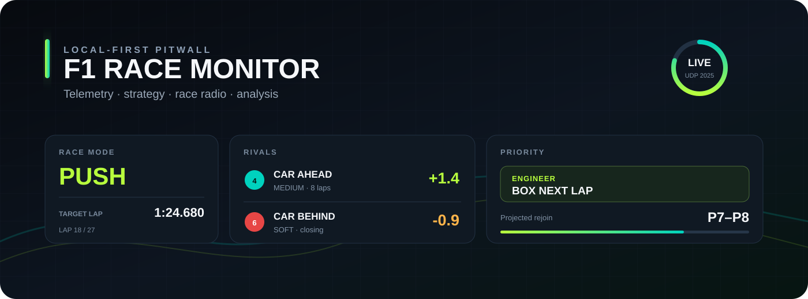
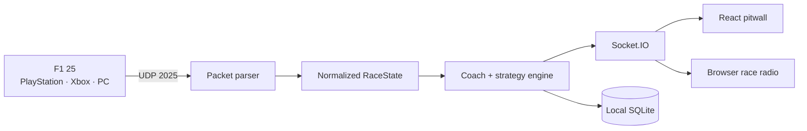

<p align="center">
  
</p>

<h1 align="center">F1 Race Monitor</h1>

<p align="center">
  A local-first race engineer for EA SPORTS F1 25.<br />
  Live timing, strategy, race radio and car health — built for a phone or tablet beside the wheel.
</p>

<p align="center">
  <a href="https://github.com/diegodella1/f1-race-monitor/actions/workflows/ci.yml"></a>
  
  
  
  
</p>

F1 Race Monitor turns the UDP telemetry already produced by F1 25 into a compact pitwall. It follows the cars around you, estimates gap trends and pit outcomes, tracks tyres and damage, and speaks only the message that matters next.

No account. No cloud. No API key. Your sessions stay on your computer.

## Why it exists

The default HUD tells you what is happening. A race engineer should help you decide what to do about it.

- **Who matters now:** the car ahead, the car behind, their compounds and the direction of both gaps.
- **One priority:** attack, defend, manage, box or stay safe — never a wall of equally urgent cards.
- **Useful strategy:** pit-window calls, projected rejoin range, undercut/overcut signals and mandatory dry-compound awareness.
- **Quiet radio:** deterministic cooldowns and per-lap limits suppress late, obvious and repetitive messages.
- **Real car state:** wing, floor, sidepod, gearbox, engine, temperatures and tyre wear.
- **Every session type:** tailored views for practice, qualifying and race.

## Current release: V2.3C

| Area | What you get |
| --- | --- |
| Pitwall | Race mode, priority action, target lap, rivals and compact trend history |
| Timing | Position, interval, gap, lap time, sectors, compound and team identity |
| Strategy | Stint degradation, pit-loss estimate, rejoin range and next-lap box calls |
| Race radio | Browser speech in Spanish or English with deduplication and urgency |
| Analysis | Per-lap throttle/brake traces and driving-performance summaries |
| Reliability | Pause tolerance, WAITING/CONNECTED state and persisted session decisions |

## Quick start

### Requirements

- Node.js 22 or newer
- EA SPORTS F1 25 on PlayStation, Xbox or PC
- The game device and this computer on the same local network

### Run in development

```bash
git clone https://github.com/diegodella1/f1-race-monitor.git
cd f1-race-monitor
npm install
npm run dev
```

Open [http://localhost:3000](http://localhost:3000). The terminal and Settings page also show the LAN address to open on a phone or tablet.

### Run the production build

```bash
npm run build
npm start
```

### Try it without a console

Open **Settings** and enable **Demo mode**. A simulated race immediately feeds every screen, so you can evaluate the dashboard and radio before configuring telemetry.

## Connect F1 25

In the game, open **Settings → Telemetry Settings** and use:

| Setting | Value |
| --- | --- |
| UDP Telemetry | On |
| UDP Broadcast Mode | Off |
| UDP IP Address | The LAN IP shown by F1 Race Monitor |
| UDP Port | `20777` by default |
| UDP Send Rate | 20 Hz |
| UDP Format | 2025 |

The app deliberately ignores self-assigned `169.254.x.x` interfaces and prefers private `192.168.x.x`, `10.x.x.x` or `172.16–31.x.x` addresses.

## The six screens

- **Race** — the pitwall: rivals, trend, strategy window, car condition and the single next action.
- **Timing** — a scan-friendly classification with lap, gap, interval, sectors, tyres and team colour.
- **Tyres** — wear, temperature, pressure, stint age and compound context.
- **Car** — live controls, energy, temperatures, damage and component health.
- **Analysis** — lap-by-lap braking/throttle traces and actionable driving comparisons.
- **Settings** — connection health, LAN QR, UDP configuration, demo mode and radio preferences.

## How it works



The backend validates F1 25 packets, normalizes partial updates into one `RaceState` and emits it through Socket.IO. The coaching and strategy layers are deterministic: every recommendation can be traced back to current telemetry and recent history. SQLite stores local sessions, laps, alerts and decision logs.

## Commands

| Command | Purpose |
| --- | --- |
| `npm run dev` | Backend and Vite frontend with live reload |
| `npm test` | Parser, persistence, radio, coaching and strategy tests |
| `npm run check` | Type-check backend and frontend |
| `npm run build` | Create production frontend and backend builds |
| `npm start` | Serve the production build |

## Privacy and scope

Telemetry and session history are written only to `data/` on the machine running the app. That directory, SQLite files, logs, environment files and build outputs are excluded from Git.

This project does not use an LLM, speech recognition, external telemetry service or cloud database. Voice output uses the browser's built-in speech synthesis.

## Roadmap

- More circuit-aware corner coaching built from lap deltas
- Stronger safety-car and mixed-weather strategy models
- Session comparison and export
- Broader validation against real F1 25 packet captures
- Installable desktop/mobile packaging

Ideas and packet captures with personal data removed are welcome. See [CONTRIBUTING.md](CONTRIBUTING.md).

## Disclaimer

This is an independent, unofficial community project. It is not affiliated with or endorsed by Formula 1, the FIA, Electronic Arts or Codemasters. All trademarks belong to their respective owners.

## License

[MIT](LICENSE)
